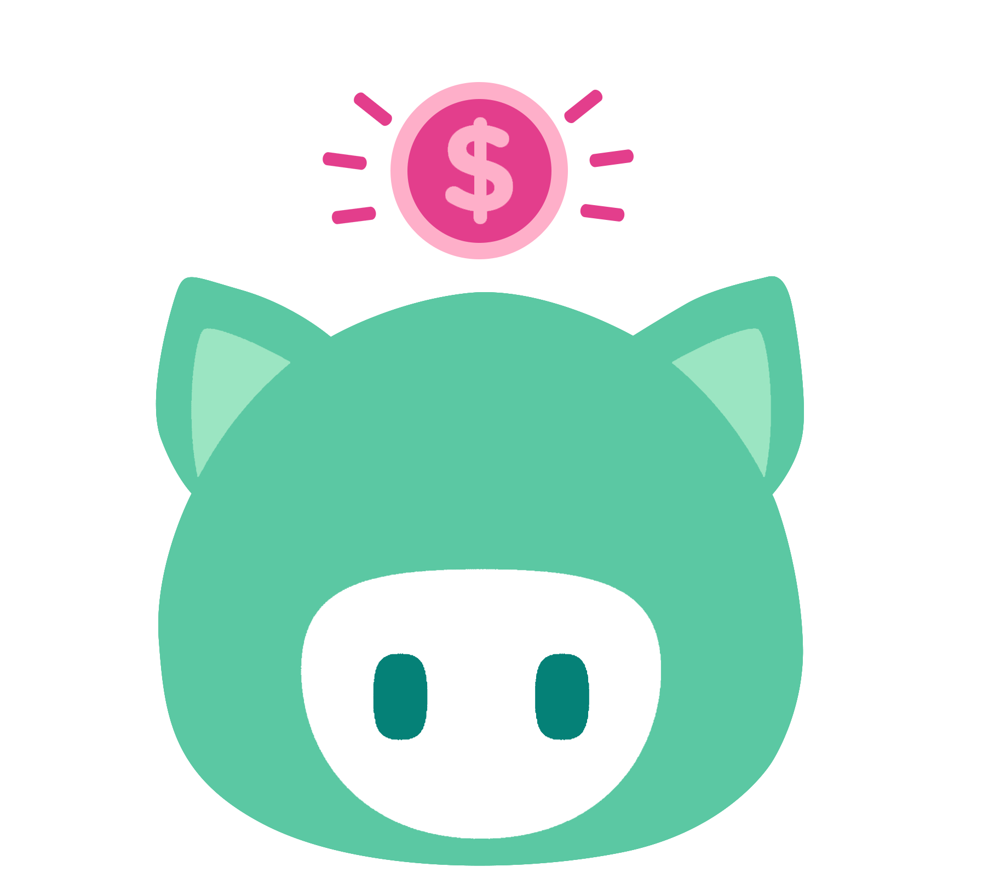

<h1 align="center">myDreamBox API</h1>

## Sobre o myDreamBox API

Com essa API, você poderá:

- Criar usuários;
- Visualizar usuários cadastrados;
- Editar usuários;
- Excluir usuários.

## Como utilizar?

A utilização é fácil, siga os passos abaixo:

<h3>O que você precisa ter?</h3>

- **[XAMPP](https://www.apachefriends.org/pt_br/index.html)**
- **[Composer](https://getcomposer.org/download/)**
- **[Laravel](https://laravel.com/)**
- **[Angular](https://angular.io/)**
- **[VS Code](https://code.visualstudio.com/Download)**

<h3>Instalação</h3>

Para isso, será necessário que você clone esse projeto para a sua máquina. 

1º - Crie um diretório específico para a aplicação

2º - Abra-o no VS Code

3º - Execute no terminal do projeto: `git init`

4º - Execute no terminal do projeto: `git clone https://github.com/luizcampos/my-dream-box-api.git`

5º - O arquivo '.env' e a pasta 'vendor' não serão clonados. Baixe-os aqui: https://drive.google.com/drive/folders/1B-lzVZPB8mJcP7Zqnewv-iBBHmcR7FIe?usp=sharing. Após isso, inclua-os no seu projeto.

<h3>Conectando ao Banco de Dados</h3>

1º - Execute o XAMPP, dando start no <strong>Apache</strong> e no <strong>MySQL</strong>

2º - Acesse http://localhost/phpmyadmin/index.php

3º - Crie o Banco de Dados com nome "mydreambox_api"

4º - Verifique se arquivo '.env', que contém todas as variáveis ambiente, possui como valor da variável DB_DATABASE o nome "mydreambox_api"

5º - No terminal do projeto execute o comando: `php artisan migrate`

<h3>Testando a aplicação</h3>

Você pode testar requisições com o <strong>Postman</strong> ou integrar o Front https://github.com/luizcampos/my-dream-box-angular-front para melhor exibição dos dados.

Antes de testar no Postman: digite  `php artisan serve` no terminal da API, aberta no VS Code, para rodar o servidor do Lavarel e permitir manipulação dos dados no DB.

O endereço do servidor deverá ser: http://127.0.0.1:8000/

## Tecnologias e ferramentas aplicadas

- **[Figma](https://www.figma.com/file/r0loiAVkuDAUsMN7AzslbF/myDreamBox?node-id=0%3A1)**
- Framework **[Laravel](https://laravel.com/)**
- **[Postman](https://www.postman.com/)**
- HTML, CSS e JavaScript
- **[Bootstrap](https://getbootstrap.com.br/)**
- Biblioteca **[Phosphor Icons](https://phosphoricons.com/)**
- **[XAMPP](https://www.apachefriends.org/pt_br/index.html)** e phpmyadmin
- **[Git](https://git-scm.com/)** e **[GitHub](https://github.com/)**  

## Autor e ajuda

O myDreamBox foi criado por Luiz Fellipe Campos. Você pode solicitar ajuda ou enviar uma mensagem através de um destes canais:

   
   
   
  

